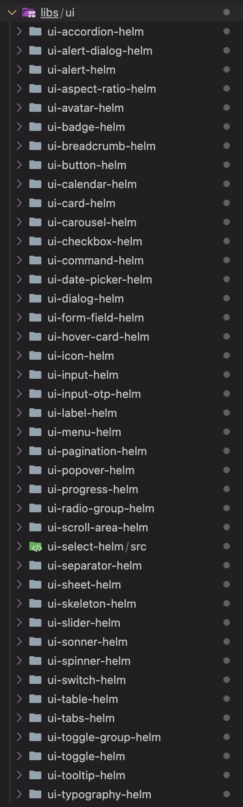

# La veille du mois: Juin 2025

A partir de ce mois ci, je vas faire un post ici tout les mois sur un sujet de veille en particulier !  
Pour le premier post, un sujet Front, plus précisément une famille de librairie de composant qui commence (enfin) à apparaître de plus en plus: *Les librairies de composants Headless*
  
## Quoi qu'est-ce (et un historique rapide)
  
Le concept n’est pas compliqué: et si on avait des composants, mais sans aucun style ?  
Juste le fonctionnement d’une dropdown, les tests, les fonctionnalités d’accessibilité, mais c’est un bouton qui affiche 3 elements span, et basta ?
  
la première fois que je suis tombé sur cette idée, c’était en cherchant une librairie au tout début d'un projet interne, je n’avais rien trouvé pour Angular à l’époque, mais je suis tombé sur un projet complètement aléatoire d’un mec qui avait eu la même idée sur VueJS: [Banshee](https://github.com/banshee-ui/banshee)  

')  
  
Bon le projet est très vite tombé à l’eau, il avait 7 ans, et le dernier commit date de... il y a 7 ans, mais il avait des super bonnes idée !  
La preuve, 2 ans plus tard, sortira [Radix](https://github.com/radix-ui/primitives), une librairie de composant, qui a repris la même idée (en appelant ça des primitives) et c’est devenu une librairie de composants majeur :grinning: de React :frowning_face:  
::: details Mais il n'y a pas que lui
*D'ailleurs, en cherchant, on tombe assez vite sur [Base UI](https://github.com/mui/base-ui), qui est la même idée, par les même devs, mais juste pas géré par une boite derriere (un thread twitter du lead du projet donne clairement l’impression que la boite a qui appartient Radix n’as pas trop envie de s’en occuper, et ça les à saouler, d’ou la nouvelle lib)*  
:::
  
&nbsp;  
  
Mais nous, on s’en fous, nous on est sur Angular, et on a rien.. **jusqu’en 2023** !  
  
## Spartan

[Spartan](https://github.com/spartan-ng/spartan) est sortie avec un pitch très simple: *et si Base UI, mais genre dans un framework qui commence pas à sentir le paracetamol ?*  


  
La librairie `spartan/ui` est composé de deux parties: `spartan/brain` et `spartain/helm`.

`spartan/brain` sont les composants de base; ils ont la mécanique, les tests, ils ont accessible, mais ils n'ont aucun style !

`spartain/helm` quand à lui, est la pour rajouter une couche de style de base au composants, inspiré de Shadcn, une autre librairie de composants React !

Le projet n'étant pas encore en 1.0, [la documentation actuelle](https://www.spartan.ng/documentation/installation) n'est pas encore complète, et ne donne que l'installation de `brain` + `helm`, mais je vais montrer les deux méthodes !

dans ces examples, je vais me baser sur un composant utilisé dans toutes nos applications: le composant `select` !

### Installation via Brain + Helm

dans un nouveau projet Angular, installez `@spartan-ng/cli` en tant que dependence de développement et `@angular/cdk` en tant que dependence

:::tabs#commands

@tab npm

```bash :no-line-numbers
npm i -D @spartan-ng/cli
```

@tab pnpm

```bash :no-line-numbers
pnpm i -D @spartan-ng/cli
```

@tab bun

```bash :no-line-numbers
bun i -D @spartan-ng/cli
```

:::

:::tabs#commands

@tab npm

```bash :no-line-numbers
npm i @angular/cdk
```

@tab pnpm

```bash :no-line-numbers
pnpm i @angular/cdk
```

@tab bun

```bash :no-line-numbers
bun i @angular/cdk
```

:::

Ensuite, installez tailwind 4 en suivant [leur guide officiel](https://tailwindcss.com/docs/installation/framework-guides/angular)

Une fois installé, importez les styles tailwind de spartan et d'Angular CDK et copiez les variables de la librairie dans le css de base de l'application Angular

```css title='style.css' :no-line-numbers
@import '@spartan-ng/brain/hlm-tailwind-preset.css';
@import '@angular/cdk/overlay-prebuilt.css';
```

```css :collapsed-lines :no-line-numbers
:root {
  --font-sans: '';
  --background: 0 0% 100%;
  --foreground: 240 10% 3.9%;
  --card: 0 0% 100%;
  --card-foreground: 240 10% 3.9%;
  --popover: 0 0% 100%;
  --popover-foreground: 240 10% 3.9%;
  --primary: 240 5.9% 10%;
  --primary-foreground: 0 0% 98%;
  --secondary: 240 4.8% 95.9%;
  --secondary-foreground: 240 5.9% 10%;
  --muted: 240 4.8% 95.9%;
  --muted-foreground: 240 3.8% 46.1%;
  --accent: 240 4.8% 95.9%;
  --accent-foreground: 240 5.9% 10%;
  --destructive: 0 84.2% 60.2%;
  --destructive-foreground: 0 0% 98%;
  --border: 240 5.9% 90%;
  --input: 240 5.9% 90%;
  --ring: 240 5.9% 10%;
  --radius: 0.5rem;
  color-scheme: light;
}

.dark {
  --background: 240 10% 3.9%;
  --foreground: 0 0% 98%;
  --card: 240 10% 3.9%;
  --card-foreground: 0 0% 98%;
  --popover: 240 10% 3.9%;
  --popover-foreground: 0 0% 98%;
  --primary: 0 0% 98%;
  --primary-foreground: 240 5.9% 10%;
  --secondary: 240 3.7% 15.9%;
  --secondary-foreground: 0 0% 98%;
  --muted: 240 3.7% 15.9%;
  --muted-foreground: 240 5% 64.9%;
  --accent: 240 3.7% 15.9%;
  --accent-foreground: 0 0% 98%;
  --destructive: 0 62.8% 30.6%;
  --destructive-foreground: 0 0% 98%;
  --border: 240 3.7% 15.9%;
  --input: 240 3.7% 15.9%;
  --ring: 240 4.9% 83.9%;
  color-scheme: dark;
}

@layer base {
  * {
    @apply border-border;
  }
}
```

Et voila, vous avez maintenant la librairie de composant de spartan installé !  
  
&nbsp;

**"...Attend mais c'est pas ce qu'on veux nous !"**

Effectivement, maintenant, utilisez cette commande

```bash :no-line-numbers
ng g @spartan-ng/cli:ui
```

La commande va vous demander les composants que vous voulez utiliser dans votre application


Une fois les composant sélectionné en utilisant la touche `Espace`, appuyez sur `Entrée` pour valider **L'installation des primitives**

Et la, votre projet contient maintenant un dossier avec la totalité des composants sélectionné !



Chaque dossier contient le composant en question, mais le code est surprenamment court...

```ts
import { ChangeDetectionStrategy, Component, computed, inject, input } from '@angular/core';
import { NgIcon, provideIcons } from '@ng-icons/core';
import { lucideCheck } from '@ng-icons/lucide';
import { hlm } from '@spartan-ng/brain/core';
import { BrnSelectOptionDirective } from '@spartan-ng/brain/select';
import { HlmIconDirective } from '../../../ui-icon-helm/src';
import type { ClassValue } from 'clsx';

@Component({
  selector: 'hlm-option',
  changeDetection: ChangeDetectionStrategy.OnPush,
  hostDirectives: [{ directive: BrnSelectOptionDirective, inputs: ['disabled', 'value'] }],
  providers: [provideIcons({ lucideCheck })],
  host: {
    '[class]': '_computedClass()',
  },
  template: `
    <ng-content />
    <span
      [attr.dir]="_brnSelectOption.dir()"
      class="absolute left-2 flex h-3.5 w-3.5 items-center justify-center rtl:left-auto rtl:right-2"
      [attr.data-state]="this._brnSelectOption.checkedState()"
    >
      @if (this._brnSelectOption.selected()) {
        <ng-icon hlm size="sm" aria-hidden="true" name="lucideCheck" />
      }
    </span>
  `,
  imports: [NgIcon, HlmIconDirective],
})
export class HlmSelectOptionComponent {
  protected readonly _brnSelectOption = inject(BrnSelectOptionDirective, { host: true });
   readonly userClass = input<ClassValue>('', { alias: 'class' });
  protected readonly _computedClass = computed(() =>
    hlm(
      'relative flex w-full cursor-default select-none items-center rounded-sm py-1.5 pl-8 pr-2 rtl:flex-reverse rtl:pr-8 rtl:pl-2 text-sm outline-none data-[active]:bg-accent data-[active]:text-accent-foreground data-[disabled]:pointer-events-none data-[disabled]:opacity-50',
      this.userClass(),
    ),
  );
}
```

Les composants ne contiennent que la partie style et la structure html, toute la partie fonctionnelle est abstraite dans `BrnSelectOptionDirective`, nous avons donc le control complet sur cette partie de la librairie, sans avoir à faire des overrides de style !

Le composant peut-être importé comme n'importe quel composant, la structure est documenté sur le site officiel de spartan:

::: tabs

@tab app.html

```html
<brn-select class="inline-block" placeholder="Select an option">
  <hlm-select-trigger class="w-56">
    <hlm-select-value />
  </hlm-select-trigger>
  <hlm-select-content>
    <hlm-option value="Refresh">Refresh</hlm-option>
    <hlm-option value="Settings">Settings</hlm-option>
    <hlm-option value="Help">Help</hlm-option>
    <hlm-option value="Signout">Sign out</hlm-option>
  </hlm-select-content>
</brn-select>
```

@tab app.ts

```ts
import { Component, effect, model } from '@angular/core';
import { BrnSelectImports } from '@spartan-ng/brain/select';

@Component({
  selector: 'app-root',
  imports: [
    BrnSelectImports
  ],
  templateUrl: './app.html',
  styleUrl: './app.css'
})
export class App {}
```

@tab app.css

```css
/* Vide ! */
```

:::


Alors faisons un petit topo de ce que nous avons :

- Un projet avec une librairie de composants: bof...
- Librairie nous donnant libre accès au style: ok pas mal...
- ...et a la structure même des composants: cool !
- La possibilité d'etendre la fonctionnalité des composants en question simplement: vendu !

Maintenant c'est pas tout rose :

- On a une dépendance sur Tailwind
- L'installation n'est pas la plus propre
- Les composants ne sont pas ajouté au projet en tant que librairie Angular, ce qui veux dire que nous n'avons aucun intellisense lorsque l'on important les composants !

::: info
A savoir que la Documentation officiel support aussi une installation via Nx, il y a même quelques étapes de l'installation qui sont simplifié (je crois que le format d'ajout au projet des composants est aussi basé sur un projet Nx d'ailleurs) mais c'est une dépendance en plus pour la librairie, et c'est pas idéale que le projet se base sur un tel pré-requis pour une aussi grosse partie de l'installation.
:::

Du coup, il y a un énorme potentiel, mais c'est pas encore ça... et ca vaut aussi pour l'utilisation de `Brain` !

### Installation via Brain

Alors pour le coup, on utilise pas Helm, du coup, l'installation est beaucoup plus simple:

:::tabs#commands

@tab npm

```bash :no-line-numbers
npm i -D @spartan-ng/cli
```

@tab pnpm

```bash :no-line-numbers
pnpm i -D @spartan-ng/cli
```

@tab bun

```bash :no-line-numbers
bun i -D @spartan-ng/cli
```

:::

:::tabs#commands

@tab npm

```bash :no-line-numbers
npm i @angular/cdk
```

@tab pnpm

```bash :no-line-numbers
pnpm i @angular/cdk
```

@tab bun

```bash :no-line-numbers
bun i @angular/cdk
```

:::

Voila.
Non, sérieux, tailwind, le dossier avec les composants, c'est que Helm, donc pour le coup, il nous faut que la base après tout !

Comme je l'avais mentionné plus haut, il n'y a aucune doc pour la layout de ces primitives actuellement, mais voila pour le composant select !

::: tabs

@tab app.html

```html
<brn-select [(value)]="selectValue" placeholder="please select an option">
  <button brnSelectTrigger>
    <brn-select-value></brn-select-value>
  </button>
  <brn-select-content>
    <div brnOption value="foo">Hello</div>
    <div brnOption value="bar">world</div>
  </brn-select-content>
</brn-select>
```

@tab app.ts

```ts
import { Component, effect, model } from '@angular/core';
import { BrnSelectImports } from '@spartan-ng/brain/select';

@Component({
  selector: 'app-root',
  imports: [
    BrnSelectImports
  ],
  templateUrl: './app.html',
  styleUrl: './app.css'
})
export class App {
  protected selectValue = model<string>();

  constructor() {
    effect(() => {
      console.log(this.selectValue());
    })
  }
}
```

@tab app.css

```css
[brnoption][aria-selected="true"]::before {
  content: "✓";
}
```

:::


C'est vide, mais au final, c'est l'idée, et aussi la force de la librairie, nous pouvons faire notre propre wrapper pour ce composant, comme les wrappers généré pour Helm au final !

Nous avons donc la même chose que la versoin Helm, mais sans les dépendances, l'installation douteuse ou même le problème d'autocomplete !

Mais gros problème de cette méthode: bonne chance pour trouver les composants / directives à importer, rien n'est documenté.

:::info
[J'ai mentionné le manque de documentation sur le github de la librairie](https://github.com/spartan-ng/spartan/issues/715), cette façon d'utiliser la librairie est bel et bien prévus, mais la doc n'est pas dans la liste des priorité, le temps de sortir la V1 !
:::

## Conclusion: Un départ timide, mais un départ

Les libraries headless on vraiment un potentiel énorme, et font déjà leur preuves chez React, mais pour le moment, Angular n'en est qu'au début, et même si rien n'est encore dans un état final, le résultat montre déjà de belles promesses !

J'espère que Spartan et tout autres librairies qui vont s'essayer à l'exercice vont pouvoir nous permettre d'aller de l'avant au comparé aux librairies de composants actuellement utilisé !

Et si ce n'est pas le cas bon au moins on a toujours Re- non je peux pas finir la phrase désolé.
